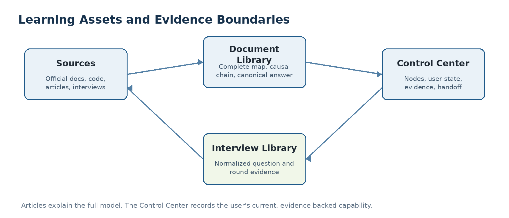
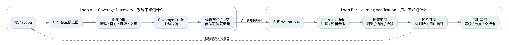
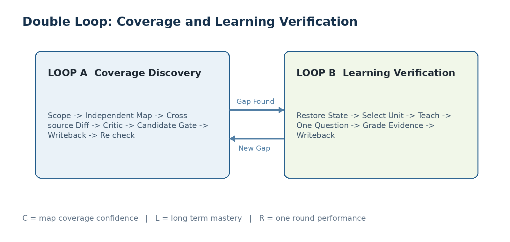
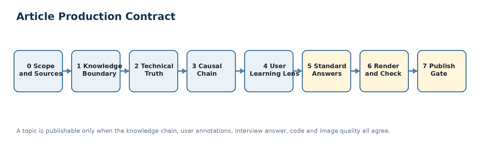
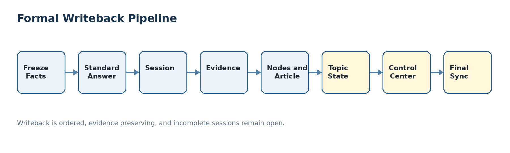
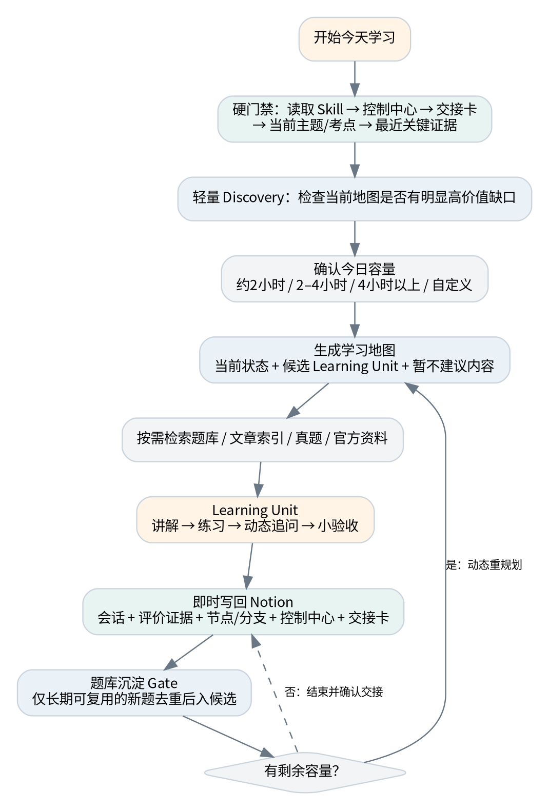

# Learning Evidence OS

> 把学习资料、个人理解、标准答案和真实表现组织成一个可验证、可回写、可长期演进的学习系统。

## 为什么要搭建自己的学习体系

在 AI 快速发展的趋势下，许多通用 Skill、提示词和固定工作流都会逐渐被模型能力吸收。越是容易被复制的套路，越难构成长期优势。真正值得沉淀的，是属于自己的目标、判断、偏好、资料、错误、证据和复盘方式。

因此，搭建个人学习体系并不是给 AI 再加一层包装，而是把自己的构思和经验变成一套可持续改进、可迁移、具有特异性和不可替代性的系统。它帮助我们在这个时代保留主动判断能力，并把这种能力扩展到阅读、语言、考试、职业训练和其他长期成长场景。

## 项目做什么

Learning Evidence OS 是一个领域无关的学习协议、对象模型、模板和 Agent Skill。它解决普通笔记库和题库很难解决的四个问题：

1. 技术知识是否完整，不能用“题库里有没有题”来判断；
2. 用户是否真正掌握，不能用“文章看完了”或“AI 给过答案”来判断；
3. 一次回答表现，不能覆盖长期掌握状态；
4. 标准答案、用户原话、评价证据和控制视图不能混成一条记录。

项目的最小闭环是：

```text
来源 → 知识资产 → Learning Unit → 实时验收 → Evidence → State → 下一轮
                    ↑                                ↓
                    └────── Coverage Discovery ─────┘
```

它不是“让 AI 每天出一道题”的题库，也不是绑定某个 SaaS 的个人页面模板。它提供一套可以先用本地 Markdown + JSON/SQLite 运行，再按需接入 Notion、Google Drive、Google Sheets、Obsidian、GitHub Issues、飞书或其他 Adapter 的通用协议。

## 项目的特异性

项目真正的特异性不在于连接了哪些工具，而在于把不同性质的事实分开，再通过双循环、证据和有序写回重新连接起来：

- **Double Loop**：Coverage Discovery 发现知识地图可能遗漏什么；Learning Verification 验证用户现在真正会什么。一个不替代另一个。
- **四层分离**：Knowledge、State、Evidence、Presentation 分别承担技术真相、当前状态、历史证据和展示视图。
- **标准答案先保存**：正式答案先成为独立的 Answer 资产，再评价用户能否独立复述，避免答案停留在聊天记录里。
- **L / R / C 分离**：长期掌握、单轮表现和地图覆盖置信度分别记录，R3 不自动等于 L3，文章完成也不自动等于 C4。
- **文章与控制中心分工**：文章负责完整知识链；控制中心负责当前状态、证据、复测和下一步。
- **Local-first 与 Adapter 可替换**：连接器是基础设施，不是 Core 的前提；断开外部服务时，系统必须安全降级，不能伪造写回成功。




## 从 V5.0 到通用 Core

V5.0 中稳定、可跨领域复用的部分进入 Core；Android 的术语、来源和面试表达进入 Profile；Notion、Drive、Sheets 进入可选 Adapter。

| V5.0 内容 | 开源后的归属 | 说明 |
|---|---|---|
| L / R / C 分离 | Core | 长期掌握、单轮表现、地图覆盖保持独立 |
| Knowledge / State / Evidence / Presentation | Core | 四类对象不能互相覆盖 |
| Double Loop | Core | 发现知识遗漏 + 验证用户掌握 |
| 标准答案与用户表现分离 | Core | Canonical Answer 不等于 Evidence |
| 文章 → 验收 → 回写 → 下一轮 | Core | 形成可追溯的长期闭环 |
| 文章、节点、证据双向导航 | Core | 内容位置和学习证据保持可追踪 |
| A-G 增量分类 | Core | “API 边界”泛化为“规则/行为边界” |
| L0-L5、R0-R5 | Core 默认定义 | Profile 可以补充领域解释，但不能破坏独立性 |
| Android / Kotlin / JVM / Gradle / Framework | `profiles/android` | 首个领域实现，不污染 Core |
| Android 控制中心 | Profile 视图 | Core 只定义 Learning Control Center 的职责 |
| 20 秒 / 60-90 秒回答 | 可选 `interview-mode` | 语言、学术和技能训练可以换成口语/考试/实操模式 |
| Notion / Drive / Sheets | 可选 Adapter | 没有这些服务也必须可运行 |
| 个人状态、真实面试记录、私有链接 | 仓库外置 | 公开包只提供脱敏示例和协议 |

## Core 对象模型

Core 只依赖稳定对象和对象之间的关系，不依赖某个页面、数据库或模型供应商。

| 对象 | 作用 | 典型内容 | 不能替代 |
|---|---|---|---|
| **Topic** | 可形成完整知识文章和多轮验收的主题边界 | 主题范围、依赖、生命周期、Topic State | 单个问题或单次成绩 |
| **Node** | 知识地图中的稳定节点或检查点 | 概念、机制、边界、关系、文章定位 | 用户掌握证据 |
| **Article** | 完整的技术/学科理解地图 | 来源、因果链、版本、边界、讲解和验收入口 | 用户是否学会 |
| **Question** | 可复用的规范化问题资产 | 原题、归一题干、题型、来源、成熟度 | 某次用户表现 |
| **Answer** | 标准化表达资产 | 短答、完整答、深入机制、反例、追问 | 用户原始回答 |
| **Session** | 一次学习、复测、面试或审计活动 | 目标、范围、实际完成、来源、handoff | 长期状态结论 |
| **Evidence** | 一次真实回答或验收的证据 | 用户原话、提示程度、错误、R、追问结果 | Canonical Answer |
| **Topic State** | 主题当前累计状态 | L、R 摘要、C、待复测、下一候选 | 历史原话和事实记录 |
| **Presentation** | 控制中心、看板和导航视图 | 当前任务、摘要、入口、提醒 | 底层事实对象 |

详细字段见 [对象模型 Schema](schemas/object-model.json)，写回边界见 [Core Protocol](skills/learning-evidence-os/references/core-protocol.md)。

## 三个维度与证据强度

### L：长期掌握

L 是跨多轮证据形成的当前长期状态，不能由一篇文章、一个 AI 答案或一次答对直接提升。

| 等级 | 默认语义 |
|---|---|
| L0 | 尚未接触或无法建立基本概念 |
| L1 | 能识别术语，依赖资料复述基本事实 |
| L2 | 能解释主要概念和基础流程，但边界或因果链不稳定 |
| L3 | 能独立解释核心机制，并回答常见边界问题 |
| L4 | 能应对深入追问、反例、工程取舍和版本差异 |
| L5 | 能迁移到陌生场景，诊断问题并形成可靠判断 |

### R：单轮表现

R 只描述本次回答或验收发生了什么，用于保留纵向证据，不覆盖 L。

| 等级 | 默认语义 |
|---|---|
| R0 | 无法回答或回答与问题无关 |
| R1 | 只能识别或复述零散关键词 |
| R2 | 有部分正确事实，但依赖明显提示或缺少因果 |
| R3 | 能独立回答主体问题，但边界、追问或迁移不足 |
| R4 | 能独立解释机制、边界并处理高价值追问 |
| R5 | 能迁移、权衡、诊断并清楚表达完整模型 |

### C：地图覆盖置信度

C 描述“我们对这张知识地图有多大把握”，不是用户掌握等级。

| 等级 | 默认语义 |
|---|---|
| C0 | 未审计，不能声称结构完整 |
| C1 | 有初始候选结构，可开始学习但保持开放 |
| C2 | 已用多类来源做差异扩展，高价值缺口明显减少 |
| C3 | 核心边界和版本已用权威来源校验 |
| C4 | 多轮使用和审计后结构稳定，但仍不代表绝对完整 |

Evidence 还要记录独立性：`independent`、`light_prompt`、`strong_prompt`、`answer_repetition` 或 `recognition`。通常只有独立解释，再加边界、追问或迁移证据，才足以支持 L3 以上判断。

## Double Loop：两个不确定性的闭环





### Loop A：Coverage Discovery

它回答：“当前知识地图可能漏了什么？”

1. 限定 Scope，不做无限扫描；
2. 暂时独立建立候选地图，不盲从现有节点；
3. 对照官方资料、源码、文章、问题资产、版本变化和现有地图；
4. 主动攻击遗漏、错误边界、浅层解释、重复节点和过期结论；
5. 通过 Candidate Gate 判断是否值得长期保留；
6. 通过 Placement Gate 做 A-G 分类；
7. 只写回最小候选数据，然后重新检查范围和题目覆盖。

Loop A 的输出主要改变 C、节点候选和内容放置，不证明用户掌握。

### A-G 增量分类

| 分类 | 放置位置 | 判断 |
|---|---|---|
| A 新独立知识节点 | 新 Topic/Node | 边界稳定且值得独立训练 |
| B 既有节点检查点或深度扩展 | 既有 Article/Node | 不必重复制造节点 |
| C 可复用问题或变体 | Question 资产 | 去个人化、可长期复测 |
| D 跨主题桥接或依赖 | 关系/依赖图 | 表达连接，不复制知识 |
| E 规则/行为边界 | Article/Node 的边界说明 | 包括使用条件、反例、版本差异 |
| F 来源或版本冲突 | 技术真相与冲突记录 | 保存来源、版本、采用结论和理由 |
| G 重复、低价值或短期细节 | 来源备注或暂存区 | 不进入长期结构，除非后续价值改变 |

### Loop B：Learning Verification

它回答：“用户现在能独立做什么？”

1. 恢复当前协议、Profile、控制视图、Topic State、handoff、文章位置和最近证据；
2. 结合 L、R、C、依赖、面试/考试价值和可用时间选择一个 Learning Unit；
3. 用来源、示例和因果链建立认知脚手架；
4. 一次只问一个问题，根据回答动态深入到机制、边界、反例、取舍和迁移；
5. 记录原话、提示程度、错误类型、R 和复测结果；
6. 按固定顺序写回，并执行 Final Sync。


最小充分上下文只装载当前主题切片、关键状态、少量候选题、必要文章位置和最近证据；长期存储可以持续增长，但一次调用仍保持小而精准。

## 文章生产与标准答案

正式文章不是零散笔记，而是一张完整理解地图。默认生产契约包含七个阶段：

1. 冻结范围、来源、版本和排除项；
2. 定义知识边界、前置依赖和易混邻居；
3. 归一技术真相，记录冲突和采用理由；
4. 构建背景 → 概念 → 机制 → 执行流程 → 工程映射 → 边界 → 误区 → 验收的完整链路；
5. 在相关段落附近加入学习者注释，但不以注释升级掌握等级；
6. 为高价值检查点生成独立的 Answer 和追问树；
7. 检查代码、图片、来源、版本和节点双向导航后再发布。



标准答案至少应保留：原题与归一题干、20 秒结论、60-90 秒完整回答、深入机制、关键边界、反例、取舍、追问、来源、版本和验证状态。它是 Knowledge/Presentation 资产，不是用户掌握证据。

## 有序写回与 Final Sync

一次学习、验收或模拟面试结束后，不能只更新一个“完成”字段。默认顺序如下：

```text
0 冻结事实
  → 1 标准答案
  → 2 Session
  → 3 Evidence
  → 4 Nodes / Article
  → 5 Topic State
  → 6 Control Center
  → 7 题库候选
  → 8 双向导航
  → 9 Final Sync
```



事实冻结时保留用户原话、来源、提示、时间范围和实际完成程度。任何失败或未完成项都标为 `partial`、`in_review` 或 `temporary`，不能伪造持久化成功，也不能用理想答案覆盖历史回答。

## Profile 与 Adapter

### Profile：领域实现

每个 Profile 至少声明：

- 范围和明确排除项；
- 知识层级、依赖和易混邻居；
- 权威来源顺序、版本策略和冲突处理；
- 领域的完整教学因果链；
- L/R 的观察标准；
- 面试、考试、口语或实操的回答格式；
- 题库去重和接纳规则；
- 可选连接器映射与隐私边界。

首个实现是 [Android Profile](profiles/android/README.md)，包括 Android、Kotlin、Java、JVM、并发、网络、性能、Framework、Gradle、架构、算法和客户端面试。

### Adapter：存储实现

| Adapter | 推荐保存 | 失败时的要求 |
|---|---|---|
| Local | Markdown 文章、JSON/SQLite 状态、本地来源索引 | 记录临时状态，使用稳定 ID 和相对链接 |
| Notion | Topic State、Node、Session、Evidence、验收板、控制视图 | 对象级报告失败，不更新完成状态 |
| Google Drive | 原始资料、长文、源码快照、版本化来源 | 只作为来源，不推断掌握等级 |
| Google Sheets | 去个人化、可复用、可去重的问题资产 | 不保存个人表现和真实面试记录 |
| 未来 Adapter | Obsidian、GitHub Issues、飞书等 | 遵守同一 Adapter Contract |

连接器必须声明读写对象、权限、稳定身份、幂等策略、冲突策略、失败输出、降级方式和是否属于外部变更。详见 [Adapter Contract](skills/learning-evidence-os/references/adapter-contract.md)。

## 快速开始

### 方式一：Local-first

适合先验证方法，不依赖第三方服务：

1. 复制 [templates](templates/) 中的 Article、Answer、Session、Acceptance Board 和 Topic Closeout 模板；
2. 使用 [Local Adapter](adapters/local/README.md) 的目录约定保存 Markdown/JSON/SQLite；
3. 为一个 Topic 创建 Learning Unit；
4. 用一次一题的对话产生 Evidence；
5. 按写回顺序保存并执行 Final Sync。

### 方式二：Notion + Google

适合已有知识库的人：先按 Adapter Contract 做字段映射，再逐个授权读取和写入。Notion、Drive、Sheets 只是实现选择，不改变 Core 的对象边界。

### 方式三：安装 Agent Skill

把 `skills/learning-evidence-os/` 复制到你的 Agent Skills 目录，然后启用 `learning-evidence-os`。Skill 不携带任何个人状态，也不会自动连接外部服务。

```text
你的 Skills 目录/
└── learning-evidence-os/
    ├── SKILL.md
    ├── agents/openai.yaml
    └── references/
```

Skill 会在正式学习前恢复最小状态，在实时验收中保留原始证据，并在外部连接器不可用时明确报告“未持久化”的对象。

## 验证用例

每个领域 Profile 都应提供最小行为验证，而不是只提供一棵知识树。[Android KMP 验证用例](profiles/android/validation-cases.md)覆盖：

1. Double Loop：地图缺口和用户掌握分别改变 C 与 L/R；
2. 标准答案保存：Answer 在 Evidence 评价前存在；
3. 累计验收：同一 Topic 的多个 Acceptance Round 不互相覆盖；
4. 双向导航：Node ↔ Article 精确位置、版本和 Evidence 关系可追踪；
5. Final Sync：控制视图和 handoff 能留下唯一下一步；
6. 失败降级：连接器写入失败时保留临时记录，绝不声称成功。

公开示例还提供了不依赖第三方包的快速检查：

```powershell
python scripts/validate_fixture.py
```

它检查对象引用、L/R/C 格式、A-G 分类、标准答案先于 Evidence、验收轮次累计、双向导航和 Final Sync 下一步。

## 公开包与私有归档

公开仓库只应包含通用协议、脱敏模板、公共来源、示例数据和可复用图示。个人状态、真实面试逐字稿、OAuth 配置、访问凭证、私有 Workspace URL、页面 ID、Drive/Sheet 文件 ID 必须留在仓库之外。

原始 V5.0 Word 文档用于提炼本项目的协议和图示，但由于其中包含个人运行状态与私有超链接，不随公共 ZIP 发布。请阅读 [私有归档说明](docs/archive/README.md)，把原始 Word 保存在仓库外；发布前不要只检查 Markdown，也要检查 DOCX 的超链接关系和隐藏元数据。

仓库内的 [协议演进说明](docs/protocol-lineage.md) 只描述方法如何从 V5.0 拆分为 Core、Profile 和 Adapter，不提供任何个人系统入口。

## 仓库结构

```text
learning-evidence-os/
├── README.md
├── skills/learning-evidence-os/ # 可安装的通用 Agent Skill
├── profiles/android/            # Android/Kotlin/JVM 领域实现与验证用例
├── adapters/                    # local / notion / google-drive / google-sheets
├── templates/                   # article / answer / session / board / closeout
├── schemas/                     # 领域无关对象模型
├── examples/android-kmp/        # 脱敏的最小领域示例
├── docs/integrations/           # 连接器职责与安全边界
├── docs/archive/                # 私有归档说明，不放原始个人文档
└── assets/diagrams/             # 从方法论提炼的公开图示
```



## 当前边界与后续路线

当前交付的是协议、Skill、Profile、模板、Schema、Adapter 契约和验证用例，不是托管 SaaS，也不是已经替用户连接外部服务的自动化平台。后续可以在不改变 Core 不变量的前提下增加：

- 可测试的 Local CLI 和 JSON/SQLite 实现；
- Notion、Google、Obsidian、GitHub Issues、飞书等 Adapter；
- Profile 生成器与 Schema 校验器；
- 脱敏迁移工具、行为回归测试和跨库导航审计；
- 语言学习、考试训练、代码审查和其他领域 Profile。

## 贡献

欢迎贡献新的领域 Profile、Adapter、脱敏示例、模板和验证用例。提交前请阅读 [CONTRIBUTING.md](CONTRIBUTING.md)，尤其确认：技术知识、个人状态、历史证据和展示视图没有混写，且没有把 AI 生成答案误写成用户掌握证据。

## License

本项目采用 [MIT License](LICENSE)。
