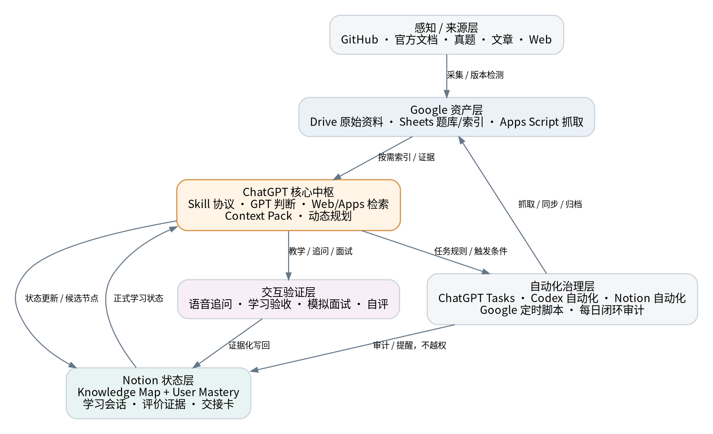
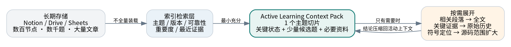

# Architecture

Learning Evidence OS 将系统拆为职责层，而不是把所有资料、状态和回答堆进同一个页面。

## 六类职责

| 层 | 责任 | 不能越界 |
|---|---|---|
| 来源与感知 | 官方文档、源码、文章、真实问题、版本变化 | 不能直接证明用户掌握 |
| 文档与知识资产 | 完整文章、因果链、标准答案、来源与版本 | 不能覆盖用户原话 |
| 个人状态 | Topic State、当前任务、L、待复测项 | 不能代替技术真相 |
| 评价证据 | 原始回答、提示、反馈、R、错误、复测 | 不能被仪表盘摘要覆盖 |
| 交互验证 | 教学、追问、模拟面试、口语验收 | 不能直接宣称持久化成功 |
| 自动化与连接器 | 检索、提醒、同步、归档、Adapter | 不能拥有最终学习裁决权 |

## 最小充分上下文

学习系统可长期保存大量对象，但一次 Agent 调用不应把全部历史带入上下文。

一次正式学习只恢复：当前协议、Profile、当前 Topic、handoff、必要文章位置、最近 Evidence、待复测项和最小来源集合。其他历史通过稳定关系和深链按需展开。

## 数据流

1. 来源进入文档库，形成可核验的知识资产。
2. Agent 依据当前状态选择 Learning Unit。
3. 学习与追问产生 Evidence。
4. Evidence 更新 State，而不是改写 Knowledge。
5. 文章、节点、标准答案、验收板和 handoff 通过双向链接保持可追溯。
